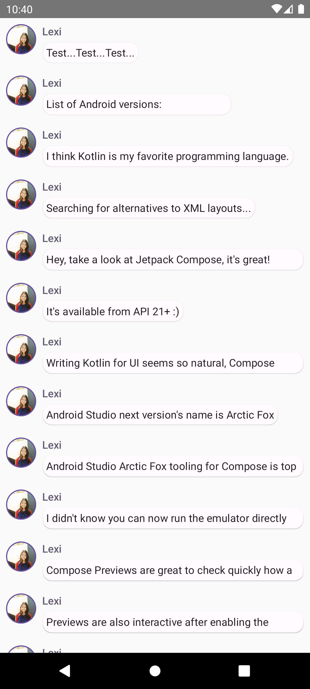

# 📱 ComposeTutorial

**ComposeTutorial** is an Android app that demonstrates basic Jetpack Compose components and interactions. It showcases a simple messaging interface where users can view and expand messages, with support for both light and dark modes.

## 🚀 Features

- **Message Cards**: Display messages with expandable content.
- **Theming**: Supports light and dark mode previews.
- **Compose Components**: Utilizes Compose elements like `LazyColumn`, `Surface`, and `AnimateContentSize`.

## 🛠️ Tech Stack

- **Kotlin**
- **Jetpack Compose**
- **Material Design 3**

## 📷 Screenshots

---

⭐ **If you like this project, don't forget to give it a star!** ⭐
